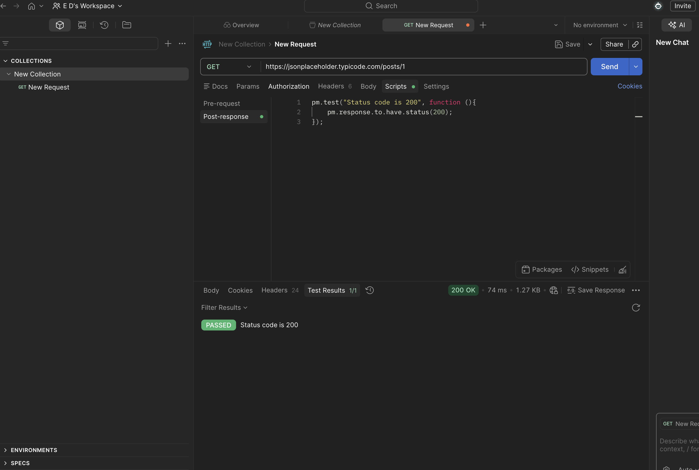

# API-007 Postman Test - Status Code 200
## Objective
Verify that the API returns HTTP status code 200.
## Request
GET/Posts/1
## Expected Result
Status Code = 200
## Actual Result
Status Code = 200
## Status
Passed
## Tested Tool
Postman
## Evidence
Screenshot: 

