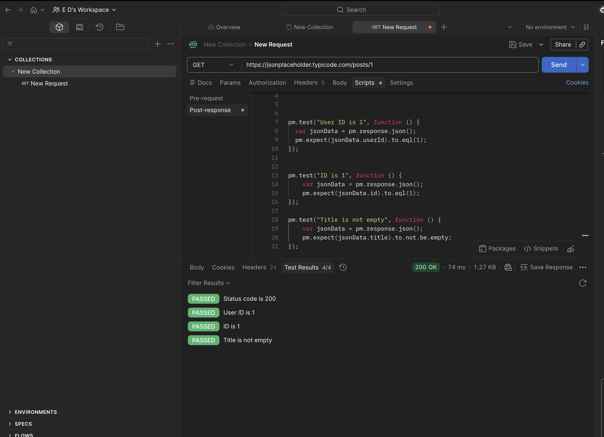

# API-008 Postman Multiple Tests
## Objective
Verify API response using multiple automated Postman tests.
## Request
GET https://jsonplaceholder.typicode.com/posts/1
## Tests Performed

-Status code = 200

-User Id = 1

-Post Id = 1

-Title is not empty

## Result
Passed
## Tool 
Postman
## Evidence 
Screenshot

