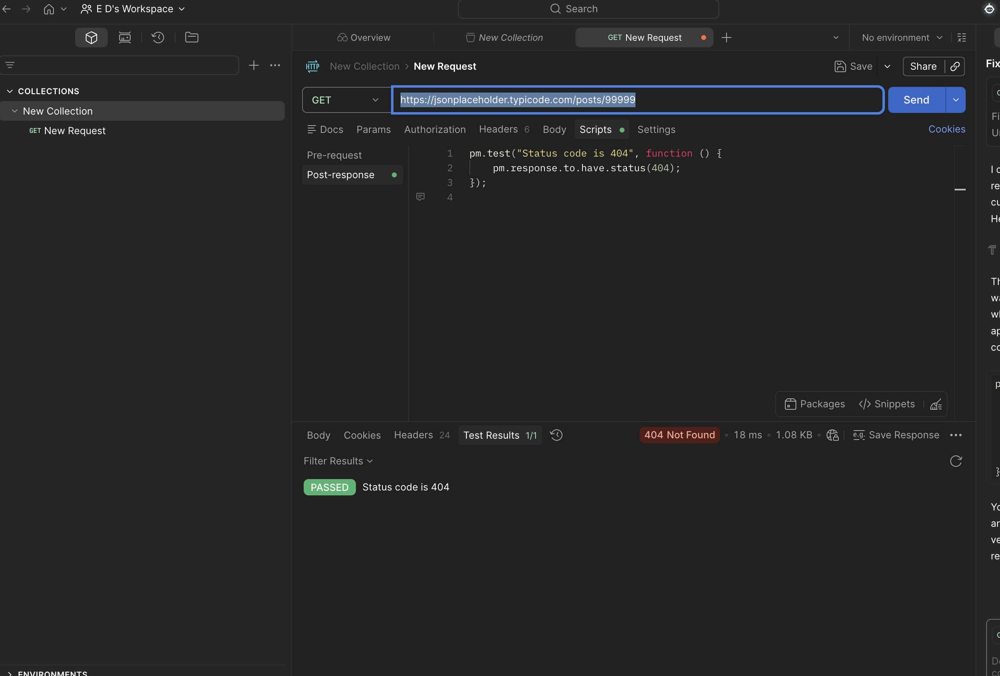

# API-009 Postman Negative Test - 404 Not Found
## Objective
Verify that API returns HTTP 404 for a non-existing post.
## Request 
GET https://jsonplaceholder.typicode.com/posts/99999
## Expected Result
Status Code = 404
## Actual Result
Status Code = 404
## Status
Passed
## Tool 
Postman
## Evidence
Screenshot

