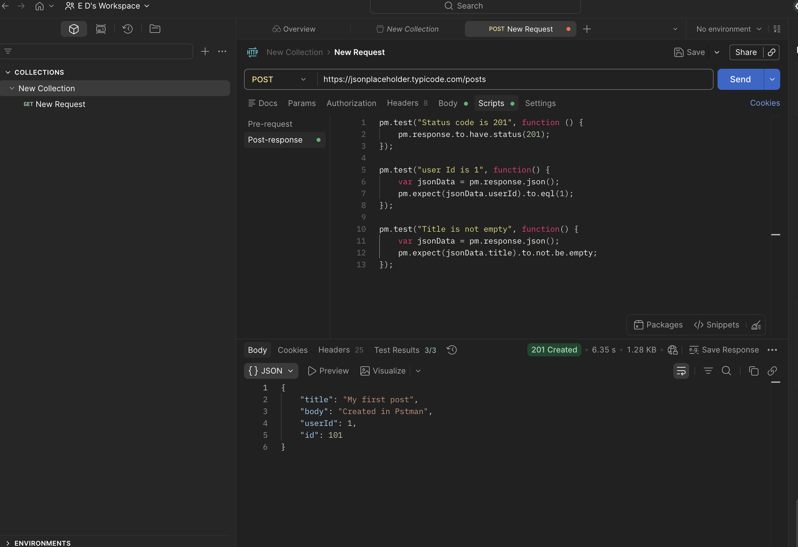

# API-010 Postman Post Request
## Objective
Verify that API creates a new post and returns HTTP status code 201.
## Request
POST https://jsonplaceholder.typicode.com/posts
Request Body :

{

    "title": "My first post",
    
    "body": "Created in Postman",
    
    "userId": 1
    
}

## Test Performed

-Status code = 201

-User ID = 1

-Title is not empty

## Result
Passed
## Tool
Postman
## Evidence
Screenshot

