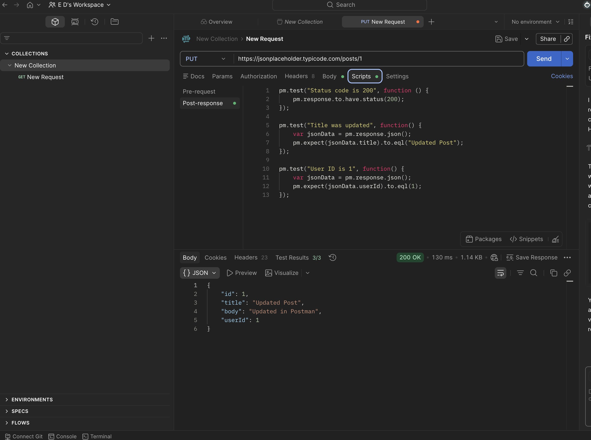

# API-011 Postman PUT Request
## Objective
Verify that API updates an existing post and returns HTTP status 200.
## Request
PUT https://jsonplaceholder.typicode.com/posts/1

Request Body:

json

{

 "id": 1,
 
 "title": "Updated Post",
 
 "body": "Updated in Postman",
 
 "userId": 1
 
}
## Test Performed

-Status code = 200

-Title was Updated 

-User ID = 1

## Result
Passed
## Tool
Postman
## Evidence
Screeenshot

