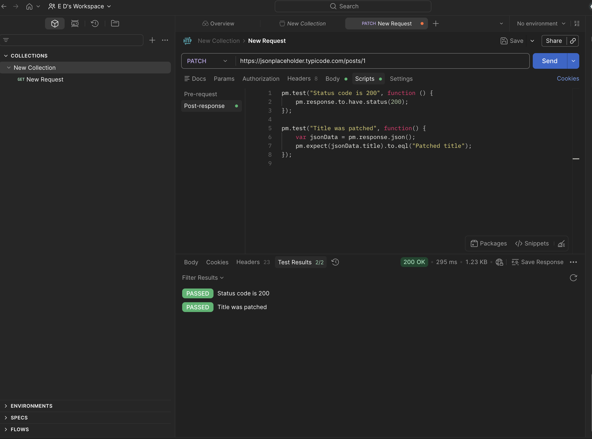

# API-012 PATCH Post
## Objective
Verify that PATCH request updates selected field.
## Request
PATCH https://jsonplaceholder.typicode.com/posts/1
## Tests Performed

-Status code = 200

-Title updated successfully

## Result
Passed
## Tool
Postman
## Evidence 
Screenshot

